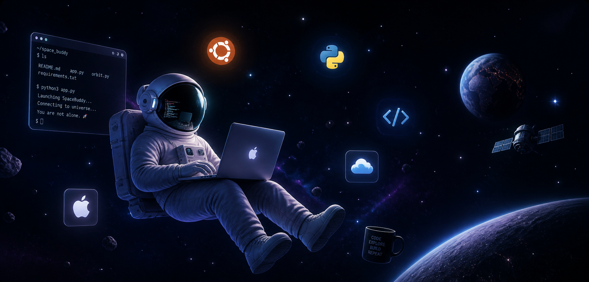

  

<h1 align="center">Hi, I’m Pat 👋</h1>

  Learning as I go, building things along the way, and exploring space-related ideas.

---

## What I’m doing

- Learning Swift (slowly, but getting there)
- Getting back into Python
- Figuring out servers, Linux, and how everything fits together
- Building <a href="https://spacebuddy.app">SpaceBuddy</a> 🚀

---

## SpaceBuddy

The idea is simple:

Space data, clean visuals, and something people can actually use.

Right now, I’m just building it out and seeing where it goes.

---

  

---

  <i>Still figuring it all out.</i>

